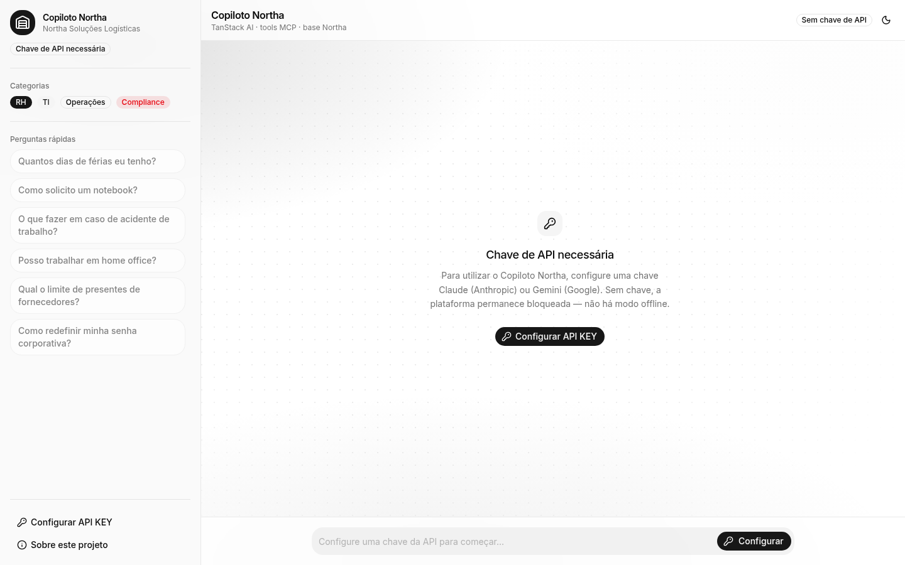
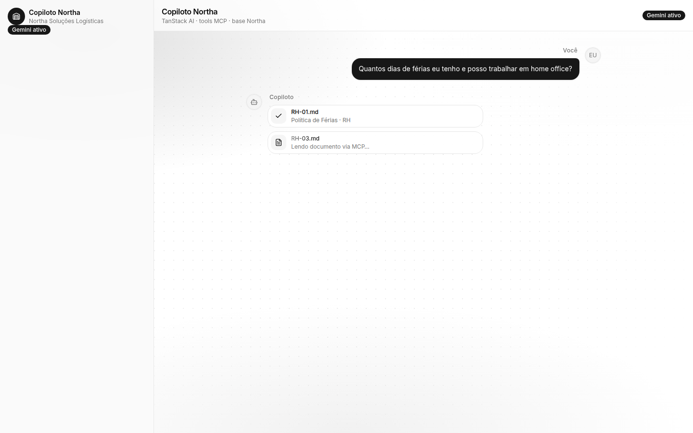
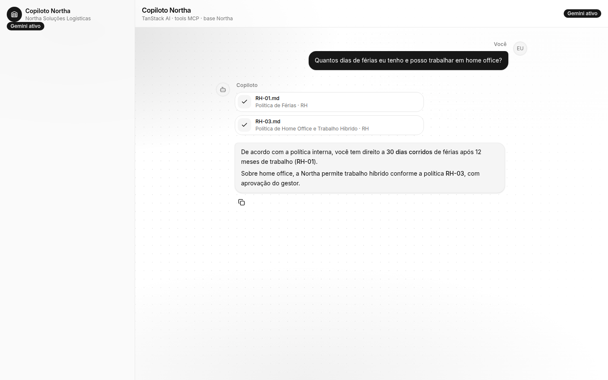
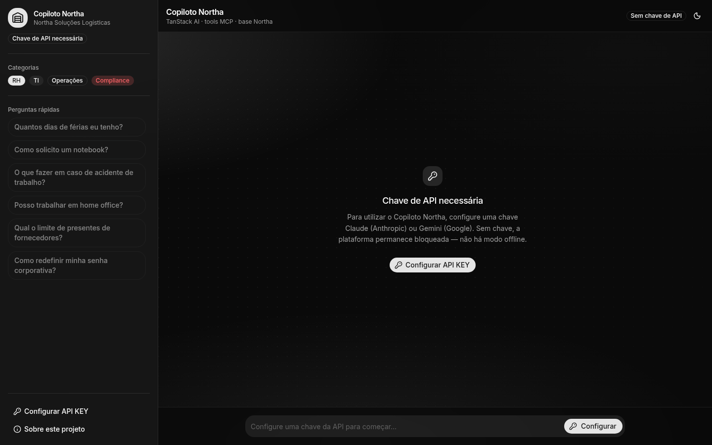
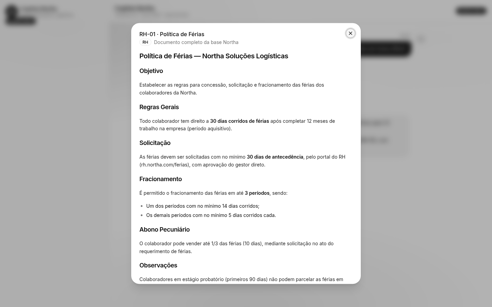

# Copiloto Northa

Assistente corporativo inteligente da empresa fictícia **Northa Soluções Logísticas**. Colaboradores fazem perguntas em linguagem natural e recebem respostas contextualizadas a partir de uma base de conhecimento interna (documentos de RH, TI, Operações e Compliance), usando IA generativa com citação das fontes consultadas.

Aplicação acadêmica da disciplina **IA Generativa Aplicada ao Desenvolvimento** (UniFECAF).

## Demonstração

**Aplicação publicada (Vercel):** [https://unifecaf-copiloto-northa.vercel.app](https://unifecaf-copiloto-northa.vercel.app)

| Tela | Preview |
| --- | --- |
| Estado vazio — texto informativo centralizado |  |
| Leitura progressiva dos documentos (Attachment em processing) |  |
| Resposta final com citação das fontes |  |
| Modo escuro |  |
| Dialog do documento em rich text |  |

## Funcionalidades principais

- **Chat em linguagem natural** sobre a base de conhecimento da Northa (RH, TI, Operações e Compliance).
- **Fluxo de resposta em etapas visíveis:**
  - indicador **Pensando…** / **Consultando a base…** com efeito `shimmer`;
  - leitura progressiva dos documentos relevantes como cartões `Attachment` (estados *idle* → *processing* → *done*);
  - só então a bolha com a resposta final.
- **Citação das fontes:** códigos dos documentos (ex.: `RH-01`, `RH-03`) na resposta e cartões de anexo clicáveis com título e categoria.
- **Dialog do documento completo**, renderizado como rich text com `react-markdown` + `remark-gfm` (não como Markdown cru).
- **Dois provedores de IA intercambiáveis:** Claude (Anthropic) e Google Gemini, configuráveis pelo usuário com chave própria. **Não há modo offline** — a chave é obrigatória.
- **Modo escuro** (toggle com `next-themes`).
- **Interface shadcn/ui** com os padrões oficiais de `Message`, `MessageScroller`, `Attachment`, `Avatar`, `Dialog`, `Bubble`, entre outros.
- **Perguntas rápidas** e categorias na barra lateral para facilitar a demonstração.
- **Servidor MCP stdio** em `mcp-server-northa/` com o mesmo contrato de tools da aplicação web (`buscar_documento_northa`, `listar_categorias_northa`), para uso em Claude Desktop / Claude Code.

## Tecnologias utilizadas

Com base no monorepo e nos `package.json` do projeto:

| Camada | Tecnologias |
| --- | --- |
| App | React 19, TypeScript, TanStack Start (Vite 8 + Nitro SSR) |
| Chat / IA | TanStack AI (`useChat` + SSE), `@tanstack/ai-anthropic`, `@tanstack/ai-gemini` |
| Modelos usados | Claude `claude-sonnet-4-6` · Gemini `gemini-2.5-flash-lite` |
| UI | Tailwind CSS 4, shadcn/ui (`packages/ui`), Lucide icons |
| Markdown | `react-markdown` + `remark-gfm` |
| Monorepo | Turborepo, Better-T-Stack, Bun (`bun@1.3.14`) |
| Deploy | Vercel |

## Ferramentas de IA utilizadas no desenvolvimento

O projeto foi desenvolvido com apoio de IA generativa em múltiplas etapas:

- **Planejamento e escopo** com Claude, em ambiente de agente, para definir o Copiloto, a base Northa e o diferencial MCP.
- **Implementação do código** no **Cursor**, em modo Agent (incluindo cloud/background agents), de forma majoritariamente conversacional.
- **MCP Context7** para consultar documentação oficial de bibliotecas (como shadcn/ui e TanStack) durante a geração de código.
- **MCP Playwright** para verificação visual automatizada das alterações (navegação, captura de tela e inspeção da árvore de elementos) pelo próprio agente.
- **Better-T-Stack** para o scaffolding inicial do monorepo Turborepo + TanStack Start.
- **Deploy** via Vercel (preview e produção).

## Model Context Protocol (MCP) neste projeto

O projeto usa MCP em dois sentidos:

1. **Apoio ao desenvolvimento** — servidores MCP no Cursor (**Context7** e **Playwright**) usados pelo agente para ler documentação e validar a UI.
2. **Princípio arquitetural do produto** — a busca de documentos (`buscar_documento_northa`) segue a lógica de uma ferramenta MCP: o modelo consulta a base antes de responder. Na interface, essa consulta é tornada visível (Pensando… → anexos em leitura → resposta), para o usuário acompanhar quais documentos estão sendo usados. O mesmo contrato de tools existe no servidor stdio `mcp-server-northa/`.

## Como rodar o projeto localmente

### 1. Instalar dependências

```bash
bun install
```

### 2. Subir o ambiente de desenvolvimento

```bash
bun dev
```

Abra [http://localhost:3001](http://localhost:3001).

> Apenas o app `apps/web`: `bun run dev:web`.

### 3. Configurar a chave de API

Na barra lateral, use o botão **Configurar API KEY**:

1. Escolha o provedor (**Claude** ou **Gemini**).
2. Cole a chave:
   - Anthropic: [console.anthropic.com/settings/keys](https://console.anthropic.com/settings/keys)
   - Gemini: [aistudio.google.com/apikey](https://aistudio.google.com/apikey)
3. Salve.

A chave e o provedor ficam salvos **apenas no `localStorage` do navegador** (`northaAiConfig:v2`) e são enviados nas requisições via headers `x-api-key` e `x-ai-provider`. Não há backend próprio de autenticação.

Opcionalmente, também é possível definir variáveis em `apps/web/.env.local` (veja `apps/web/.env.example`): `GEMINI_API_KEY` / `ANTHROPIC_API_KEY` e `AI_PROVIDER`.

### 4. Build de produção

```bash
bun run build
```

## Estrutura do projeto

```text
.
├── apps/web/                         # Aplicação TanStack Start (única app executável)
│   ├── src/
│   │   ├── components/               # Copiloto, atividade MCP, dialog, tema
│   │   ├── data/documentos-northa/   # Base de conhecimento (Markdown)
│   │   ├── lib/                      # Tools, busca, API key, knowledge-base
│   │   └── routes/                   # UI (/) e API (/api/chat)
│   └── package.json
├── packages/
│   ├── ui/                           # Componentes shadcn/ui compartilhados
│   ├── env/                          # Validação de variáveis de ambiente
│   └── config/                       # Config TypeScript compartilhada
├── mcp-server-northa/                # Servidor MCP stdio (mesmo contrato de tools)
├── docs/screenshots/                 # Prints usados neste README
├── scripts/                          # Utilitários (ex.: sync de env Vercel)
├── turbo.json                        # Pipelines Turborepo
└── package.json                      # Workspace Bun + scripts raiz
```

## Limitações conhecidas

- **Sem controle de acesso por usuário** — qualquer pessoa com a URL pode usar a aplicação; todos os documentos da base são visíveis a quem configurar uma chave.
- **Chave no navegador** — a chave do usuário fica no `localStorage` e é enviada ao `/api/chat`; não há cofre/backend próprio protegendo o segredo do usuário final.
- **Dependência de cota dos provedores** — durante o desenvolvimento, tanto a API da Anthropic quanto a do Gemini (nível gratuito) atingiram limites de uso (`429` / `RESOURCE_EXHAUSTED`). Isso pode se repetir para quem testar com chave gratuita. O app usa `gemini-2.5-flash-lite` para reduzir o consumo no Gemini.
- **Busca textual simples** — a relevância é por sobreposição de termos (`apps/web/src/lib/search.ts`), **sem embeddings vetoriais**.
- **Base estática e fictícia** — documentos Markdown da Northa; não há banco de dados nem atualização dinâmica.

## Licença / créditos

Não há arquivo de licença no repositório. Este é um **projeto acadêmico** da disciplina *IA Generativa Aplicada ao Desenvolvimento* (UniFECAF), desenvolvido com apoio de ferramentas de IA generativa conforme descrito acima.
