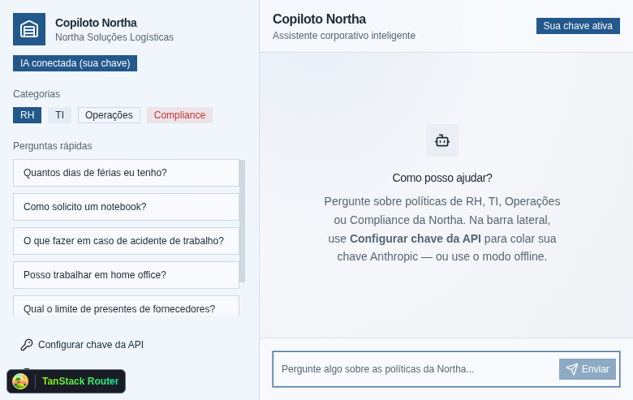
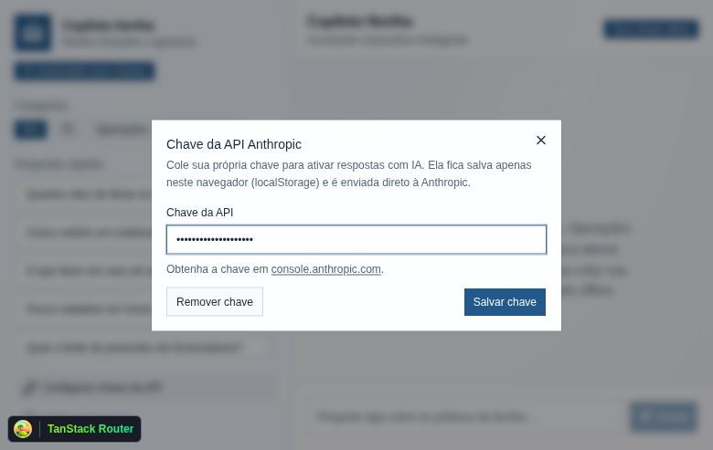
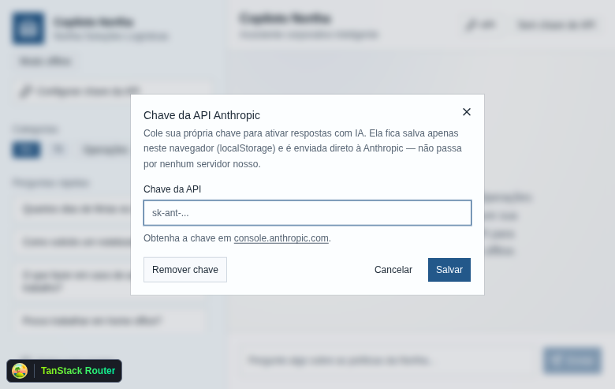

# Copiloto Northa

Assistente corporativo inteligente da empresa fictícia **Northa Soluções Logísticas**. Colaboradores fazem perguntas em linguagem natural e recebem respostas contextualizadas a partir de uma base de conhecimento interna (RH, TI, Operações e Compliance).

Aplicação acadêmica da disciplina **IA Generativa Aplicada ao Desenvolvimento** (UniFECAF).

## Tecnologias utilizadas

- **Better-T-Stack** — scaffold do monorepo
- **Turborepo** — orquestração de builds e scripts
- **TanStack Start** — app React com Vite e SSR
- **TanStack AI** — `useChat` + SSE (`fetchServerSentEvents`) + `chat()` no servidor
- **@tanstack/ai-anthropic** — adapter Anthropic (Claude)
- **React 19** + **TypeScript**
- **Tailwind CSS** + **shadcn/ui**
- **Bun** — runtime e gerenciador de pacotes

## Ferramentas de IA

| Contexto | Ferramentas |
| --- | --- |
| Desenvolvimento | Cursor + Claude (geração de código, refino de prompts, estruturação do monorepo) |
| Aplicação | TanStack AI + Anthropic (`claude-sonnet-4-6`) com tools isomórficas ao MCP |
| Diferencial MCP | Servidor MCP em `mcp-server-northa/` + mesmas tools no `/api/chat` |

## Fluxo de perguntas (TanStack AI)

1. O client usa `useChat` + `fetchServerSentEvents("/api/chat")` (mesmo padrão do helper [shadcn TanStack AI](https://ui.shadcn.com/docs/helpers/tanstack-ai), porém com conexão real à API).
2. A rota `POST /api/chat` chama `chat()` com `createAnthropicChat` e as tools:
   - `buscar_documento_northa`
   - `listar_categorias_northa`
3. O modelo **consulta a base via tool** antes de responder (mesmo contrato do servidor MCP).
4. A UI faz streaming SSE e exibe as fontes citadas a partir do resultado da tool.

A **chave da API Anthropic é obrigatória**. Sem ela, o chat fica bloqueado até a configuração.

## Como executar

### 1. Instalar dependências

```bash
bun install
```

### 2. Configurar a chave da Anthropic (obrigatório)

Há duas formas (a chave do navegador tem prioridade no header `x-api-key`):

1. **Pelo app (recomendado para demonstração):** na barra lateral, botão **Configurar chave da API** → cole a chave e salve.
2. **Por ambiente:** crie `apps/web/.env.local`:

```bash
ANTHROPIC_API_KEY=sua_chave_aqui
# opcional / compatibilidade com o client:
VITE_ANTHROPIC_API_KEY=sua_chave_aqui
```

Há um exemplo em `apps/web/.env.example`. Sem chave, o envio de perguntas permanece desabilitado.

### 3. Rodar em desenvolvimento

```bash
bun dev
```

Abra [http://localhost:3001](http://localhost:3001).

### 4. Build de produção

```bash
bun run build
```

## Prints da aplicação

| Tela | Arquivo |
| --- | --- |
| Chat / empty state |  |
| Configurar chave da API |  |
| Modal da chave (detalhe) |  |

## Base de conhecimento

Documentos em `apps/web/src/data/documentos-northa/`:

| Código | Título | Categoria |
| --- | --- | --- |
| RH-01 | Política de Férias | RH |
| RH-02 | Benefícios Corporativos | RH |
| RH-03 | Home Office e Trabalho Híbrido | RH |
| TI-01 | Solicitação de Equipamentos | TI |
| TI-02 | Redefinição de Senha | TI |
| TI-03 | Acesso VPN | TI |
| OPS-01 | Acidente de Trabalho | Operações |
| OPS-02 | Uso de EPI | Operações |
| COMP-01 | Código de Conduta | Compliance |
| COMP-02 | Presentes e Brindes | Compliance |

## Servidor MCP (diferencial)

As mesmas tools usadas no `/api/chat` estão expostas via stdio em `mcp-server-northa/` para Claude Desktop / Claude Code:

```bash
cd mcp-server-northa
npm install
npm start
```

Veja `mcp-server-northa/README.md` para conectar no Claude Desktop ou Claude Code.

## Deploy na Vercel

1. Link do projeto: `bun run deploy:setup`
2. Defina `ANTHROPIC_API_KEY` (e opcionalmente `VITE_ANTHROPIC_API_KEY`) no painel da Vercel
3. Preview: `bun run deploy`
4. Produção: `bun run deploy:prod`

Configuração em `vercel.json`. Variáveis locais (`.env.local`) **não** sobem automaticamente no deploy.

## Estrutura relevante

```
apps/web/
  src/
    components/copiloto-northa.tsx   # UI + useChat (TanStack AI)
    data/documentos-northa/          # Base de conhecimento (Markdown)
    lib/
      knowledge-base.ts              # Parse e export dos documentos
      search.ts                      # Retrieval por relevância
      northa-tools.ts                # Tools MCP (TanStack AI toolDefinition)
      api-key.ts                     # Chave no localStorage / env (obrigatória)
    routes/
      index.tsx                      # Rota principal
      api/chat.ts                    # POST /api/chat (SSE + Anthropic)

mcp-server-northa/                   # Servidor MCP stdio (mesmo contrato de tools)
```
